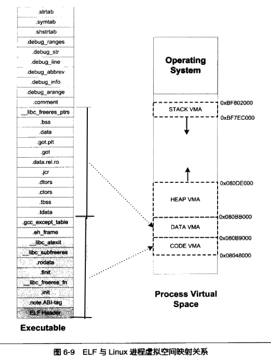

# qemu源码分析v0.1.6

## 前言

为了学习TCG动态插桩，有了qemu源码分析系列。qemu这个开源软件随着时间不断完善虚拟化的功能，qemu已经变得很复杂，一开始直接看最新的源码会很吃力，所以先从低版本开始阅读。笔者实力有限，如果文章有误请提出来。

## 源码分析

v0.1.6版本是qemu早期的一个版本，这时候TCG技术还没有引入。这个版本只实现了x86架构的用户态模拟。

### main

工作流程：解析参数，加载目标ELF，建立linux进程初始状态，创建x86cpu以一个`CPUX86State`来表示，初始化段寄存器，进入cpu执行循环。

```c
// linux-user/main.c
int main(int argc, char **argv)
{
    // 执行程序文件名
    const char *filename;
    // 目标程序启动时的寄存器状态
    struct target_pt_regs regs1, *regs = &regs1;
    // 目标ELF的内存布局信息
    struct image_info info1, *info = &info1;
    // 模拟linux task/process状态
    TaskState ts1, *ts = &ts1;
    // x86CPU模拟状态
    CPUX86State *env;
    int optind;
    const char *r;
    // 提供可执行程序，不然打印usage 
    if (argc <= 1)
        usage();

    loglevel = 0;
    optind = 1;
    for(;;) {
        if (optind >= argc)
            break;
        r = argv[optind];
        if (r[0] != '-')
            break;
        optind++;
        r++;
        if (!strcmp(r, "-")) {
            break;
        // 开启debug
        } else if (!strcmp(r, "d")) {
            loglevel = 1;
        // 设置用户栈大小
        } else if (!strcmp(r, "s")) {
            r = argv[optind++];
            x86_stack_size = strtol(r, (char **)&r, 0);
            if (x86_stack_size <= 0)
                usage();
            if (*r == 'M')
                x86_stack_size *= 1024 * 1024;
            else if (*r == 'k' || *r == 'K')
                x86_stack_size *= 1024;
        // 指定目标程序依赖的ELF interpreter / 动态库路径
        } else if (!strcmp(r, "L")) {
            interp_prefix = argv[optind++];
        } else {
            usage();
        }
    }
    if (optind >= argc)
        usage();
    filename = argv[optind];

    /* init debug */
    // 打开日志文件
    if (loglevel) {
        logfile = fopen(DEBUG_LOGFILE, "w");
        if (!logfile) {
            perror(DEBUG_LOGFILE);
            _exit(1);
        }
        setvbuf(logfile, NULL, _IOLBF, 0);
    }

    /* Zero out regs */
    // 清空进程寄存器
    memset(regs, 0, sizeof(struct target_pt_regs));

    /* Zero out image_info */
    // 清空elf空间信息
    memset(info, 0, sizeof(struct image_info));

    /* Scan interp_prefix dir for replacement files. */
    // 初始化ELF interpreter / 动态库路径前缀
    init_paths(interp_prefix);
    // 处理目标可执行程序的信息
    if (elf_exec(filename, argv+optind, environ, regs, info) != 0) {
	printf("Error loading %s\n", filename);
	_exit(1);
    }
    
    if (loglevel) {
        fprintf(logfile, "start_brk   0x%08lx\n" , info->start_brk);
        fprintf(logfile, "end_code    0x%08lx\n" , info->end_code);
        fprintf(logfile, "start_code  0x%08lx\n" , info->start_code);
        fprintf(logfile, "end_data    0x%08lx\n" , info->end_data);
        fprintf(logfile, "start_stack 0x%08lx\n" , info->start_stack);
        fprintf(logfile, "brk         0x%08lx\n" , info->brk);
        fprintf(logfile, "esp         0x%08lx\n" , regs->esp);
        fprintf(logfile, "eip         0x%08lx\n" , regs->eip);
    }
    // 设置brk
    target_set_brk((char *)info->brk);
    // syscall初始化
    syscall_init();
    // signal初始化
    signal_init();
    // 创建cpu
    env = cpu_x86_init();
    // 保存一个全局cpu指针
    global_env = env;

    /* build Task State */
    memset(ts, 0, sizeof(TaskState));
    env->opaque = ts;
    ts->used = 1;
    
    /* linux register setup */
    // 寄存器状态迁移
    env->regs[R_EAX] = regs->eax;
    env->regs[R_EBX] = regs->ebx;
    env->regs[R_ECX] = regs->ecx;
    env->regs[R_EDX] = regs->edx;
    env->regs[R_ESI] = regs->esi;
    env->regs[R_EDI] = regs->edi;
    env->regs[R_EBP] = regs->ebp;
    env->regs[R_ESP] = regs->esp;
    env->eip = regs->eip;

    /* linux segment setup */
    // GDT初始化
    env->gdt.base = (void *)gdt_table;
    env->gdt.limit = sizeof(gdt_table) - 1;
    // 建立用户态CS，DS描述符
    // >>3是获取GDTindex
    write_dt(&gdt_table[__USER_CS >> 3], 0, 0xffffffff, 1);
    write_dt(&gdt_table[__USER_DS >> 3], 0, 0xffffffff, 1);
    // 加载 CS / DS / SS
    cpu_x86_load_seg(env, R_CS, __USER_CS);
    cpu_x86_load_seg(env, R_DS, __USER_DS);
    cpu_x86_load_seg(env, R_ES, __USER_DS);
    cpu_x86_load_seg(env, R_SS, __USER_DS);
    cpu_x86_load_seg(env, R_FS, __USER_DS);
    cpu_x86_load_seg(env, R_GS, __USER_DS);
    // 执行目标程序
    cpu_loop(env);
    /* never exits */
    return 0;
}

```

解释一下其中出现过的结构体

`target_pt_regs`结构体定义了x86架构下的标志寄存器、通用寄存器组和段寄存器，用来模拟真实寄存器。

```c
// syscall-i386.h
struct target_pt_regs {
	long ebx;
	long ecx;
	long edx;
	long esi;
	long edi;
	long ebp;
	long eax;
	int  xds;
	int  xes;
	long orig_eax;
	long eip;
	int  xcs;
	long eflags;
	long esp;
	int  xss;
};

```

`image_info`记录目标进程的地址空间信息。

```c
// linux-user/qemu.h
struct image_info {
	unsigned long	start_code; // 代码段的开始位置
	unsigned long	end_code;   // 代码段的结束位置
	unsigned long	end_data;   // 数据段的结束位置
	unsigned long	start_brk;  // start_brk的位置
	unsigned long	brk;	    // brk的位置
	unsigned long	start_mmap; // 映射的开始位置
	unsigned long	mmap;	 
	unsigned long	rss;	    // 程序实际消耗页的数量
	unsigned long	start_stack;// 栈的开始位置
	unsigned long	arg_start;  // 传参的开始位置
	unsigned long	arg_end;    // 传参的结束位置
	unsigned long	env_start;  // 环境变量的开始位置
	unsigned long	env_end;    // 环境变量的结束位置
	unsigned long	entry;	    // 执行代码的入口
	int		personality;// 描述某些兼容行为/ABI 行为
};
```

`TaskState`管理任务的结构体。

在qemu中，可能需要并发执行多个任务。每个任务可以有自己的 CPU 寄存器状态、栈空间等。`TaskState`可以用于管理这些任务的状态，并在任务切换时保存和恢复寄存器状态，用next指针将任务链接起来。

```c
// linux-user/qemu.h
typedef struct TaskState {
    struct TaskState *next;
    struct target_vm86plus_struct *target_v86;
    struct vm86_saved_state vm86_saved_regs;
    int used; /* non zero if used */
    uint8_t stack[0];
} __attribute__((aligned(16))) TaskState;
```

#### efl_exec



打开ELF文件，准备参数环境，加载ELF映像，设置入口和栈指针。

```c
// linux-user/elfload.c

/* 加载并解析elf文件 
 * @param filename 文件名称
 * @param argv 参数
 * @param envp 环境变量
 * @param regs 寄存器信息
 * @param infop 镜像信息
 */
int elf_exec(const char * filename, char ** argv, char ** envp, 
             struct target_pt_regs * regs, struct image_info *infop)
{
	// 保存加载一个新程序时的临时加载信息
        struct linux_binprm bprm;
        int retval;
        int i;
	// 保存参数/环境变量临时存储区域中的当前位置
        bprm.p = X86_PAGE_SIZE*MAX_ARG_PAGES-sizeof(unsigned int);
	// 清空参数页
        for (i=0 ; i<MAX_ARG_PAGES ; i++)       /* clear page-table */
                bprm.page[i] = 0;
	// 打开elf执行文件
        retval = open(filename, O_RDONLY);
        if (retval == -1) {
	    perror(filename);
	    exit(-1);
            /* return retval; */
	}
	else {
	    bprm.fd = retval;
	}
	// 初始化linux_binprm
        bprm.filename = (char *)filename;
        bprm.sh_bang = 0;
        bprm.loader = 0;
        bprm.exec = 0;
        bprm.dont_iput = 0;
	bprm.argc = count(argv);
	bprm.envc = count(envp);
	// 准备执行文件的基本信息
        retval = prepare_binprm(&bprm);

	// 将执行的文件名，参数个数，以及环境变量拷贝到bprm.p指向的区域
        if(retval>=0) {
	    bprm.p = copy_strings(1, &bprm.filename, bprm.page, bprm.p);
	    bprm.exec = bprm.p;
	    bprm.p = copy_strings(bprm.envc,envp,bprm.page,bprm.p);
	    bprm.p = copy_strings(bprm.argc,argv,bprm.page,bprm.p);
	    if (!bprm.p) {
		retval = -E2BIG;
	    }
        }
	// 加载ELF文件
        if(retval>=0) {
	    retval = load_elf_binary(&bprm,regs,infop);
	}
        if(retval>=0) {
	    /* success.  Initialize important registers */
	    regs->esp = infop->start_stack;
	    regs->eip = infop->entry;
	    return retval;
	}

        /* Something went wrong, return the inode and free the argument pages*/
	// 如果出现失败，则释放参数页
        for (i=0 ; i<MAX_ARG_PAGES ; i++) {
	    free_page((void *)bprm.page[i]);
	}
        return(retval);
}

```

##### prepare_binprm

```c
#define MAX_ARG_PAGES 32
#define X86_PAGE_SIZE 4096 /* 一页一般为4k */
/* 初始化二进制程序参数 */
static int prepare_binprm(struct linux_binprm *bprm)
{
    struct stat     st;
    int mode;
    int retval;
    fstat(bprm->fd, &st);
    mode = st.st_mode;
    assert(S_ISREG(mode));      /* Must be regular file */
    assert((mode & 0111));      /* Must have at least one execute bit set */
    bprm->e_uid = geteuid();
    bprm->e_gid = getegid();
	// ...
    memset(bprm->buf, 0, sizeof(bprm->buf));
    retval = lseek(bprm->fd, 0L, SEEK_SET);
    assert(retval >= 0);
    retval = read(bprm->fd, bprm->buf, 128);
    assert(retval >= 0);
    return(retval);
}
```

##### copy_string

```c
/*
 * 'copy_string()' copies argument/envelope strings from user
 * memory to free pages in kernel mem. These are in a format ready
 * to be put directly into the top of new user memory.
 * @param argc 参数个数
 * @param argv 参数数组
 * @param page 数组,用于记录页内存的首地址(不是页号)
 * @param p 空间大小,也就是不能拷贝的字符不能超过p字节
 */
static unsigned long copy_strings(int argc,char ** argv,unsigned long *page,
                                  unsigned long p)
{
    char *tmp, *tmp1, *pag = NULL;
    int len, offset = 0;
	assert(p);
    while (argc-- > 0)
    {
        if (!(tmp1 = tmp = get_user(argv+argc)))
        {
            fprintf(stderr, "VFS: argc is wrong");
            exit(-1);
        }
        while (get_user(tmp++));
        len = tmp - tmp1; /* 获得参数长度 */
        if (p < len)    /* this shouldn't happen - 128kB */
        {
            return 0;
        }
        while (len)
        {
            --p;
            --tmp;
            --len;
            if (--offset < 0)
            {
                offset = p % X86_PAGE_SIZE; /* X86_PAGE_SIZE为4096 */
                if (!(pag = (char *) page[p/X86_PAGE_SIZE]) &&
                    !(pag = (char *) page[p/X86_PAGE_SIZE] =
                                (unsigned long *) get_free_page()))
                /* get_free_page分配一块4096大小的内存块 */
                {
                    return 0;
                }
            }
            if (len == 0 || offset == 0)
            {
                *(pag + offset) = get_user(tmp);
            }
            else
            {
                int bytes_to_copy = (len > offset) ? offset : len; /* 需要拷贝的字节数目 */
                tmp -= bytes_to_copy;
                p -= bytes_to_copy;
                offset -= bytes_to_copy;
                len -= bytes_to_copy;
                memcpy_fromfs(pag + offset, tmp, bytes_to_copy + 1);
            }
        }
    }
    return p;
}
```

`linux_binprm`用于记录二进制文件的一些信息.,这个结构体也是linux内核早期版本用于`execve()` 系统调用的核心结构体，当进程调用 `execve()` 加载一个新程序时，内核会临时创建并填充这个结构体，然后交给不同的二进制格式处理器。

```c
/*
 * This structure is used to hold the arguments that are
 * used when loading binaries.
 * 此结构体用于记录加载二进制文件时所持有的参数信息
 */
struct linux_binprm
{
    char buf[128];
    unsigned long page[MAX_ARG_PAGES]; /* 每个元素都是一块内存的首地址,内存大小4k,用于辅助构建elf镜像的栈底数据 */
    unsigned long p;
    int sh_bang;
    int fd; /* elf程序的文件描述符 */
    int e_uid, e_gid;
    int argc; /* 参数个数 */
    int envc;
    /* 二进制文件的名称 */
    char * filename;        /* Name of binary */
    unsigned long loader;
    unsigned long exec;
    int dont_iput;          /* binfmt handler has put inode */
};
```

#### load_elf_binary

加载 `elf` 至内存,一共分为如下几步:

+ 遍历程序头表,找到类型为 `INTERP` 的 `segment`, 它的实际内容就是一个字符串,用于指示动态链接器(一般就是 `libc.so` )的路径
+ 调用 `setup_arg_pages` 函数来初始化栈,在栈中放置好环境变量以及程序运行参数
+ 遍历程序头表, 找到类型为 `LOAD` 的 `segment`, 根据程序头的描述,做文件映射.根据程序头的描述设置好映射地址段的属性(可读/可写/执行).根据程序头所期望的虚拟地址来设置映射地址段的首地址
+ 根据前面得到的动态链接器的路径加载动态链接器至内存,对应函数为 `load_elf_interp` 
+ 调用 `set_brk` 以及 `padzero` 设置好镜像的 `bss` 段

```c
// linux-user/elfload.c
/* 加载elf文件,这个函数实际实现了一个elf程序加载器
 * @param regs 寄存器信息
 */
static int load_elf_binary(struct linux_binprm * bprm, struct target_pt_regs * regs,
                           struct image_info * info)
{
    struct elfhdr elf_ex;
    struct elfhdr interp_elf_ex;
    struct exec interp_ex;
    int interpreter_fd = -1; /* avoid warning */
    unsigned long load_addr, load_bias;
    int load_addr_set = 0;
    unsigned int interpreter_type = INTERPRETER_NONE;
    unsigned char ibcs2_interpreter;
    int i;
    void * mapped_addr;
    struct elf_phdr *elf_ppnt;
    struct elf_phdr *elf_phdata;
    unsigned long elf_bss, k, elf_brk;
    int retval;
    char * elf_interpreter;
    unsigned long elf_entry, interp_load_addr = 0;
    int status;
    unsigned long start_code, end_code, end_data;
    unsigned long elf_stack;
    char passed_fileno[6];
    ibcs2_interpreter = 0;
    status = 0;
    load_addr = 0;
    load_bias = 0;
    elf_ex = *((struct elfhdr *) bprm->buf);          /* exec-header */
    assert(elf_ex.e_ident[0] == 0x7f);
    assert(!strncmp(&elf_ex.e_ident[1], "ELF",3)); /* 校验elf头部标识,保证是elf文件 */
    /* 现在读取所有的头部信息 */
    elf_phdata = (struct elf_phdr *)malloc(elf_ex.e_phentsize*elf_ex.e_phnum);
    /* 读取程序头表,加载elf程序,实际只需要头表信息即可 */
    retval = lseek(bprm->fd, elf_ex.e_phoff, SEEK_SET);
    if (retval > 0)
    {
        retval = read(bprm->fd, (char *) elf_phdata,
                      elf_ex.e_phentsize * elf_ex.e_phnum);
    }
    assert(retval >= 0);
    elf_ppnt = elf_phdata;
    elf_bss = 0;
    elf_brk = 0;
    elf_stack = ~0UL;
    elf_interpreter = NULL;
    start_code = ~0UL;
    end_code = 0;
    end_data = 0;
    /* 这里可以默认elf_phdr为elf32_phdr
     * Phdr表示Program Header Table 也就是程序表头
     */
    for(i = 0; i < elf_ex.e_phnum; i++)
    {
    	/* 链接器,用户写的代码并不能直接跑,还需要一个libc.so来引导,程序入口并不是main
		 * 而是libc中的_start
    	 */
        if (elf_ppnt->p_type == PT_INTERP)
        {
            /* This is the program interpreter used for
             * shared libraries - for now assume that this
             * is an a.out format binary
             */
            elf_interpreter = (char *)malloc(elf_ppnt->p_filesz);
            /* 根据偏移来读取Segment(段) */
            retval = lseek(bprm->fd, elf_ppnt->p_offset, SEEK_SET);
            if (retval >= 0)
            {
                retval = read(bprm->fd, elf_interpreter, elf_ppnt->p_filesz);
            }
            assert(retval >= 0);
            /* If the program interpreter is one of these two,
               then assume an iBCS2 image. Otherwise assume
               a native linux image. */
            /* JRP - Need to add X86 lib dir stuff here... */
            /* 链接器的路径 */
            if (strcmp(elf_interpreter,"/usr/lib/libc.so.1") == 0 ||
                strcmp(elf_interpreter,"/usr/lib/ld.so.1") == 0)
            {
                ibcs2_interpreter = 1;
            }
            printf("Using ELF interpreter %s\n", elf_interpreter); /* 打印解析器的路径 */
            /* 加载链接器, elf_interpreter记录了链接器的路径 */
            retval = open(path(elf_interpreter), O_RDONLY);
            assert(retval >= 0);
            interpreter_fd = retval;
            retval = lseek(interpreter_fd, 0, SEEK_SET);
            assert(retval >= 0)
            {
                retval = read(interpreter_fd,bprm->buf,128);
            }
            interp_ex = *((struct exec *) bprm->buf); /* aout exec-header */
            interp_elf_ex=*((struct elfhdr *) bprm->buf); /* elf exec-header */
        }
        elf_ppnt++; /* 指向下一个程序头 */
    }
    /* Some simple consistency checks for the interpreter */
    if (elf_interpreter)
    {
        // 为了简单,后续默认解析器格式为ELF
        interpreter_type = INTERPRETER_ELF;
        // ...
    }

    /* OK, we are done with that, now set up the arg stuff,
       and then start this sucker up */
	// ...
    /* OK, This is the point of no return */
    info->end_data = 0;
    info->end_code = 0;
    info->start_mmap = (unsigned long)ELF_START_MMAP; /* 硬编码程序起始地址0x80000000 */
    info->mmap = 0;
    /* 入口地址,规定ELF程序的入口虚拟地址,操作系统在加载完该程序后从这个地址开始执行进程的指令,可重定向
     * 文件一般没有入口地址,则这个值为0
     */
    elf_entry = (unsigned long) elf_ex.e_entry;

    /* Do this so that we can load the interpreter, if need be.  We will
       change some of these later */
    info->rss = 0;
    bprm->p = setup_arg_pages(bprm->p, bprm, info); /* 初始化栈 */
    info->start_stack = bprm->p; /* 记录下栈顶 */
    /* Now we do a little grungy work by mmaping the ELF image into
     * the correct location in memory.  At this point, we assume that
     * the image should be loaded at fixed address, not at a variable
     * address.
     * 将ELF镜像映射到内存中正确的位置,在这个时候,我们假定镜像应当被加载到固定的地址,而不是一个可变的地址
     * ELF之中,segment会按照虚拟地址从小到大排序.正常情况就第一个Segment为代码段,最后一个为数据段
     *    Program Headers:
     *     Type    Offset   VirtAddr PhysAddr   FileSiz     MemSiz      Flags  Align
     *     PHDR    0x000040 0x00040  0x00040    0x0000002d8 0x0000002d8  R      0x8
     *     INTERP  0x000318 0x00318  0x00318    0x00000001c 0x00000001c  R      0x1
     *         [Requesting program interpreter: /lib64/ld-linux-x86-64.so.2]
     *     LOAD    0x001000 0x01000  0x01000    0x000000225 0x000000225  R E    0x1000  # 代码段
     *     LOAD    0x002000 0x02000  0x02000    0x000000190 0x000000190  R      0x1000
     *     LOAD    0x002db8 0x03db8  0x03db8    0x000000260 0x000000268  RW     0x1000  # 数据段
     */
    for (i = 0, elf_ppnt = elf_phdata; i < elf_ex.e_phnum; i++, elf_ppnt++)
    {
        int elf_prot = 0; /* 属性 */
        int elf_flags = 0;
        unsigned long error;
        /* 只有LOAD类型的segment才是需要被映射的 */
        if (elf_ppnt->p_type != PT_LOAD) /* 只处理LOAD类型的segment */
            continue;
        if (elf_ppnt->p_flags & PF_R) elf_prot |= PROT_READ;
        if (elf_ppnt->p_flags & PF_W) elf_prot |= PROT_WRITE;
        if (elf_ppnt->p_flags & PF_X) elf_prot |= PROT_EXEC;
        elf_flags = MAP_PRIVATE | MAP_DENYWRITE;
        if (elf_ex.e_type == ET_EXEC || load_addr_set)
        {
            elf_flags |= MAP_FIXED; /* 映射到固定的位置 */
        }
        else if (elf_ex.e_type == ET_DYN) /* 动态库 */
        {
            /* Try and get dynamic programs out of the way of the default mmap
               base, as well as whatever program they might try to exec.  This
               is because the brk will follow the loader, and is not movable.  */
            /* NOTE: for qemu, we do a big mmap to get enough space
               without harcoding any address */
            error = (unsigned long)mmap4k(NULL, ET_DYN_MAP_SIZE,
                                          PROT_NONE, MAP_PRIVATE | MAP_ANON,
                                          -1, 0);
            /* 到这里,error记录的是实际映射的位置,这个和elf中期望映射的地址其实还是有偏差的
             * 因此就出现了load_bias
             */
            load_bias = X86_ELF_PAGESTART(error - elf_ppnt->p_vaddr);
        }
        /* 这里直接做了映射操作,为每一个segment都执行一个映射
         * elf_ppnt->p_vaddr记录的是虚拟地址
         */
        error = (unsigned long)mmap4k(
                    X86_ELF_PAGESTART(load_bias + elf_ppnt->p_vaddr), /* elf中指定了段加载的虚拟地址 */
                    (elf_ppnt->p_filesz +
                     X86_ELF_PAGEOFFSET(elf_ppnt->p_vaddr)), /* p_filesz记录了段大小 */
                    elf_prot, /* 段属性 */
                    (MAP_FIXED | MAP_PRIVATE | MAP_DENYWRITE),
                    bprm->fd, /* 文件映射 */
                    (elf_ppnt->p_offset -
                     X86_ELF_PAGEOFFSET(elf_ppnt->p_vaddr)));
        if (!load_addr_set)
        {
            load_addr_set = 1; /* 加载地址确定了 */
            /* load_addr记录实际的虚拟加载地址
             * 这里举一个简单的例子:
             * Program Headers:
             *  Type           Offset   VirtAddr   PhysAddr   FileSiz MemSiz  Flg Align
             *  LOAD           0x000000 0x08048000 0x08048000 0x000ac 0x000ac R E 0x1000
             * 在这个segment中, p_vaddr为0x08048000, p_offset为0
             * load_bias在大多数情况下,都是0
             */
            load_addr = elf_ppnt->p_vaddr - elf_ppnt->p_offset; 
            /* 也就是从虚拟地址load_addr处开始映射segment(段) */
            if (elf_ex.e_type == ET_DYN) /* 动态库 */
            {
                load_bias += error -
                             X86_ELF_PAGESTART(load_bias + elf_ppnt->p_vaddr);
                load_addr += load_bias;
            }
        }
        /* 一般来说,代码段在低地址,数据段在高地址 */
        k = elf_ppnt->p_vaddr; /* 期望的虚拟地址 */
        if (k < start_code)
            start_code = k; /* 记录下代码段的起始地址(第一个load类型的segment的起始地址) */
        /* p_filesz表示segment在elf文件中所占用空间的长度 */
        k = elf_ppnt->p_vaddr + elf_ppnt->p_filesz; /* 一般而言,p_filesz <= p_memsz */
        /* .bss段不占用文件空间,但是要置为0 */
        if (k > elf_bss)
            elf_bss = k; /* elf_bss指向bss段的开始 */
        if ((elf_ppnt->p_flags & PF_X) && end_code <  k) /* 可执行的段就是代码段 */
            end_code = k; /* end_code是代码段的尾部地址 */
        if (end_data < k)
            end_data = k;
        /* p_memsz表示segment在进程虚拟地址空间中所占的长度 */
        k = elf_ppnt->p_vaddr + elf_ppnt->p_memsz;
        if (k > elf_brk) elf_brk = k;
    }
    /* elf_entry是ELF程序的入口虚拟地址,在x86下,这个值一般为0x804874 */
    elf_entry += load_bias;
    elf_bss += load_bias;
    elf_brk += load_bias;
    start_code += load_bias;
    end_code += load_bias;
    end_data += load_bias;
    if (elf_interpreter) /* 动态链接器 */
    {
        /* elf_entry是程序应当执行的第一条指令所在的虚拟地址 */
        elf_entry = load_elf_interp(&interp_elf_ex, interpreter_fd,
                                    &interp_load_addr); /* 加载elf格式的动态链接器 */
        // ...
        assert(elf_entry);
    }
    free(elf_phdata);
    if (interpreter_type != INTERPRETER_AOUT) close(bprm->fd);
    info->personality = (ibcs2_interpreter ? PER_SVR4 : PER_LINUX);
    bprm->p = (unsigned long)
              create_elf_tables((char *)bprm->p,
                                bprm->argc,
                                bprm->envc,
                                (interpreter_type == INTERPRETER_ELF ? &elf_ex : NULL),
                                load_addr, load_bias,
                                interp_load_addr,
                                (interpreter_type == INTERPRETER_AOUT ? 0 : 1),
                                info);
    info->start_brk = info->brk = elf_brk; /* 程序可以从这个位置开始执行brk */
    info->end_code = end_code;
    info->start_code = start_code;
    info->end_data = end_data;
    info->start_stack = bprm->p; /* 堆栈位置 */
    /* Calling set_brk effectively mmaps the pages that we need for the bss and break
       sections */
    set_brk(elf_bss, elf_brk); /* elf_bss以及elf_brk之间的内存为bss段 */
    padzero(elf_bss); /* 将bss段清零 */
	// ...
    info->entry = elf_entry; /* 程序的执行的第一条指令的地址来自动态解析器,一般是_start函数 */
    return 0;
}
```

来看堆栈初始化代码

```c
    //...
    /* Do this so that we can load the interpreter, if need be.  We will
       change some of these later */
    info->rss = 0;
    bprm->p = setup_arg_pages(bprm->p, bprm, info); /* 初始化栈 */
    info->start_stack = bprm->p; /* 记录下栈顶 */
    //...
    /* 堆栈初始化的收尾工作在create_elf_tables中执行 */
    bprm->p = (unsigned long)
        create_elf_tables((char *)bprm->p,
                          bprm->argc,
                          bprm->envc,
                          (interpreter_type == INTERPRETER_ELF ? &elf_ex : NULL),
                          load_addr, load_bias,
                          interp_load_addr,
                          (interpreter_type == INTERPRETER_AOUT ? 0 : 1),
                          info);
```

+ 调用 `setup_arg_pages` 分配好堆栈的内存,将环境变量,程序参数等信息填充进堆栈
+ 调用 `create_elf_tables` 初始化好 `Environment Pointers`, `Argument Pointers`等值

##### setup_arg_pages

分配一段地址作为堆栈,首地址由操作系统随机分配,属性为可读/可写,大小一般为 `x86_stack_size`.将辅助结构中构建的页拷贝到新分配的堆栈中去。

```c
unsigned long setup_arg_pages(unsigned long p, struct linux_binprm * bprm,
                              struct image_info * info)
{
    unsigned long stack_base, size, error;
    int i;
    /* Create enough stack to hold everything.  If we don't use
     * it for args, we'll use it for something else...
     * 创造一个足够的stack来保存everything
     */
    size = x86_stack_size; /* 栈大小默认为512k */
    if (size < MAX_ARG_PAGES*X86_PAGE_SIZE)
        size = MAX_ARG_PAGES*X86_PAGE_SIZE;
    /* error记录的是栈的首地址 */
    error = (unsigned long)mmap4k(NULL,
                                  size + X86_PAGE_SIZE,
                                  PROT_READ | PROT_WRITE,
                                  MAP_PRIVATE | MAP_ANONYMOUS,
                                  -1, 0);
    assert(error != -1);
    /* 随机选择一个地址作为栈 */
    /* we reserve one extra page at the top of the stack as guard */
    /* 在栈的顶部保留一个额外的page用作保护 */
    mprotect((void *)(error + size), X86_PAGE_SIZE, PROT_NONE);
    /* 栈基址 */
    stack_base = error + size - MAX_ARG_PAGES*X86_PAGE_SIZE; /* 栈前方要放置参数信息 */
    p += stack_base; /* p指向栈顶 */
    if (bprm->loader)
    {
        bprm->loader += stack_base;
    }
    bprm->exec += stack_base;

    for (i = 0 ; i < MAX_ARG_PAGES ; i++)
    {
        if (bprm->page[i])
        {
            info->rss++;
            /* 拷贝参数信息到栈里面 */
            memcpy((void *)stack_base, (void *)bprm->page[i], X86_PAGE_SIZE);
            free_page((void *)bprm->page[i]);
        }
        stack_base += X86_PAGE_SIZE;
    }
    return p; /* 返回栈顶地址 */
}
```

##### create_elf_tables

```c
#define put_user(x,ptr) (void)(*(ptr) = (typeof(*ptr))(x))
#define get_user(ptr) (typeof(*ptr))(*(ptr))

/* Symbolic values for the entries in the auxiliary table
   put on the initial stack */
#define AT_NULL   0	/* end of vector */
#define AT_IGNORE 1	/* entry should be ignored */
#define AT_EXECFD 2	/* file descriptor of program */
#define AT_PHDR   3	/* program headers for program */
#define AT_PHENT  4	/* size of program header entry */
#define AT_PHNUM  5	/* number of program headers */
#define AT_PAGESZ 6	/* system page size */
#define AT_BASE   7	/* base address of interpreter */
#define AT_FLAGS  8	/* flags */
#define AT_ENTRY  9	/* entry point of program */
#define AT_NOTELF 10	/* program is not ELF */
#define AT_UID    11	/* real uid */
#define AT_EUID   12	/* effective uid */
#define AT_GID    13	/* real gid */
#define AT_EGID   14	/* effective gid */
#define AT_PLATFORM 15  /* string identifying CPU for optimizations */
#define AT_HWCAP  16    /* arch dependent hints at CPU capabilities */
#define AT_CLKTCK 17	/* frequency at which times() increments */


static unsigned int * create_elf_tables(char *p, int argc, int envc,
                                        struct elfhdr * exec,
                                        unsigned long load_addr,
                                        unsigned long load_bias,
                                        unsigned long interp_load_addr, int ibcs,
                                        struct image_info *info)
{
    target_ulong *argv, *envp, *dlinfo;
    target_ulong *sp;
    /*
     * Force 16 byte alignment here for generality.
     */
    sp = (unsigned int *) (~15UL & (unsigned long) p);
    sp -= exec ? DLINFO_ITEMS*2 : 2; /* 栈向低地址扩展 */
    dlinfo = sp; /* 栈顶地址 */
    sp -= envc+1;
    envp = sp;
    sp -= argc+1;
    argv = sp;
    if (!ibcs)
    {
        put_user(tswapl((target_ulong)envp),--sp);
        put_user(tswapl((target_ulong)argv),--sp);
    }
/* tswapl(id)等价于id */
#define NEW_AUX_ENT(id, val) \
          put_user (tswapl(id), dlinfo++); \
          put_user (tswapl(val), dlinfo++)
	/*  */
    if (exec)   /* Put this here for an ELF program interpreter */
    {	/* 这里放置的信息供ELF程序解析器使用? */
        NEW_AUX_ENT (AT_PHDR, (target_ulong)(load_addr + exec->e_phoff)); /* 程序头 */
        NEW_AUX_ENT (AT_PHENT, (target_ulong)(sizeof (struct elf_phdr))); /* 程序头大小 */
        NEW_AUX_ENT (AT_PHNUM, (target_ulong)(exec->e_phnum)); /* 程序头的个数 */
        NEW_AUX_ENT (AT_PAGESZ, (target_ulong)(ALPHA_PAGE_SIZE)); /* 页大小 */
        NEW_AUX_ENT (AT_BASE, (target_ulong)(interp_load_addr));
        NEW_AUX_ENT (AT_FLAGS, (target_ulong)0);
        NEW_AUX_ENT (AT_ENTRY, load_bias + exec->e_entry);
        NEW_AUX_ENT (AT_UID, (target_ulong) getuid());
        NEW_AUX_ENT (AT_EUID, (target_ulong) geteuid());
        NEW_AUX_ENT (AT_GID, (target_ulong) getgid());
        NEW_AUX_ENT (AT_EGID, (target_ulong) getegid());
    }
    NEW_AUX_ENT (AT_NULL, 0);
#undef NEW_AUX_ENT
    put_user(tswapl(argc),--sp); /* 存放参数个数 */
    info->arg_start = (unsigned int)((unsigned long)p & 0xffffffff);
    while (argc-- > 0)
    {
        put_user(tswapl((target_ulong)p),argv++); /* Argument Pointers */
        while (get_user(p++)) /* nothing */ ;
    }
    put_user(0,argv); /* 放0表示结束 */
    info->arg_end = info->env_start = (unsigned int)((unsigned long)p & 0xffffffff);
    while (envc-- > 0)
    {
        put_user(tswapl((target_ulong)p),envp++); /* Environment Pointers */
        while (get_user(p++)) /* nothing */ ;
    }
    put_user(0,envp); /* 放0表示结束 */
    info->env_end = (unsigned int)((unsigned long)p & 0xffffffff);
    return sp;
}
```

加载动态链接器片段代码

```c
    if (elf_interpreter) /* 动态链接器 */
    {
        /* elf_entry是程序应当执行的第一条指令所在的虚拟地址 */
        elf_entry = load_elf_interp(&interp_elf_ex, interpreter_fd,
                                    &interp_load_addr); /* 加载elf格式的动态链接器 */
        // ...
        assert(elf_entry);
    }
```

##### load_elf_interp

将 `elf_bss` 以及 `elf_brk` 之间的内存作为为 `bss` 段, 并将这段内存清零。

```c
/* 加载动态链接器
 * @return 加载的动态链接器的第一条指令的地址
 */
static unsigned long load_elf_interp(struct elfhdr * interp_elf_ex,
                                     int interpreter_fd,
                                     unsigned long *interp_load_addr)
{
    struct elf_phdr *elf_phdata  =  NULL;
    struct elf_phdr *eppnt;
    unsigned long load_addr = 0;
    int load_addr_set = 0;
    int retval;
    unsigned long last_bss, elf_bss;
    unsigned long error;
    int i;
    elf_bss = 0;
    last_bss = 0;
    error = 0;
	// ... 跳过校验代码
    /* Now read in all of the header information */
    if (sizeof(struct elf_phdr) * interp_elf_ex->e_phnum > X86_PAGE_SIZE)
        return ~0UL;
    elf_phdata =  (struct elf_phdr *)
                  malloc(sizeof(struct elf_phdr) * interp_elf_ex->e_phnum);
	// ...
    retval = lseek(interpreter_fd, interp_elf_ex->e_phoff, SEEK_SET);
    if (retval >= 0)
    {
        retval = read(interpreter_fd,
                      (char *) elf_phdata,
                      sizeof(struct elf_phdr) * interp_elf_ex->e_phnum);
    }
    assert(retval >= 0);

    if (interp_elf_ex->e_type == ET_DYN)
    {
        /* in order to avoid harcoding the interpreter load
           address in qemu, we allocate a big enough memory zone */
        error = (unsigned long)mmap4k(NULL, INTERP_MAP_SIZE,
                                      PROT_NONE, MAP_PRIVATE | MAP_ANON,
                                      -1, 0);
        assert(error != -1);
        load_addr = error; /* 因为是动态库,所以加载地址随机 */
        load_addr_set = 1;
    }

    eppnt = elf_phdata;
    for (i = 0; i < interp_elf_ex->e_phnum; i++, eppnt++) /* 遍历程序头 */
        if (eppnt->p_type == PT_LOAD)
        {
            int elf_type = MAP_PRIVATE | MAP_DENYWRITE;
            int elf_prot = 0;
            unsigned long vaddr = 0;
            unsigned long k;
            if (eppnt->p_flags & PF_R) elf_prot =  PROT_READ;
            if (eppnt->p_flags & PF_W) elf_prot |= PROT_WRITE;
            if (eppnt->p_flags & PF_X) elf_prot |= PROT_EXEC;
            if (interp_elf_ex->e_type == ET_EXEC || load_addr_set)
            {
                elf_type |= MAP_FIXED;
                vaddr = eppnt->p_vaddr;
            }
            /* 执行映射操作 */
            error = (unsigned long)mmap4k(load_addr+X86_ELF_PAGESTART(vaddr),
                                          eppnt->p_filesz + X86_ELF_PAGEOFFSET(eppnt->p_vaddr),
                                          elf_prot,
                                          elf_type,
                                          interpreter_fd,
                                          eppnt->p_offset - X86_ELF_PAGEOFFSET(eppnt->p_vaddr));
            // ... ignore error
            if (!load_addr_set && interp_elf_ex->e_type == ET_DYN)
            {
                load_addr = error;
                load_addr_set = 1;
            }
            /*
             * Find the end of the file  mapping for this phdr, and keep
             * track of the largest address we see for this.
             * elf_bss记录最大的地址
             */
            k = load_addr + eppnt->p_vaddr + eppnt->p_filesz;
            if (k > elf_bss) elf_bss = k;
            /*
             * Do the same thing for the memory mapping - between
             * elf_bss and last_bss is the bss section.
             */
            k = load_addr + eppnt->p_memsz + eppnt->p_vaddr;
            if (k > last_bss) last_bss = k;
        }

    /* Now use mmap to map the library into memory. */
    close(interpreter_fd);
    /*
     * Now fill out the bss section.  First pad the last page up
     * to the page boundary, and then perform a mmap to make sure
     * that there are zeromapped pages up to and including the last
     * bss page.
     * 现在填充bss section.
     */
    padzero(elf_bss);
    elf_bss = X86_ELF_PAGESTART(elf_bss + ALPHA_PAGE_SIZE - 1); /* What we have mapped so far */
    /* Map the last of the bss segment */
    if (last_bss > elf_bss)
    {
        mmap4k(elf_bss, last_bss-elf_bss,
               PROT_READ|PROT_WRITE|PROT_EXEC,
               MAP_FIXED|MAP_PRIVATE|MAP_ANONYMOUS, -1, 0);
    }
    free(elf_phdata);
    *interp_load_addr = load_addr;
    return ((unsigned long) interp_elf_ex->e_entry) + load_addr;
}
```

bss段初始化代码

```c
set_brk(elf_bss, elf_brk); /* elf_bss以及elf_brk之间的内存为bss段 */
```

##### set_brk

会将 `elf_bss` 以及 `elf_brk` 之间的内存作为为 `bss` 段, 并将这段内存清零。

```c
/* 执行映射操作
 * @param start 起始虚拟地址
 * @param end 终止虚拟地址
 */
static void set_brk(unsigned long start, unsigned long end)
{
    /* page-align the start and end addresses... */
    start = ALPHA_PAGE_ALIGN(start);
    end = ALPHA_PAGE_ALIGN(end);
    if (end <= start)
        return;
    if ((long)mmap4k(start, end - start,
                    PROT_READ | PROT_WRITE | PROT_EXEC,
                    MAP_FIXED | MAP_PRIVATE | MAP_ANONYMOUS, -1, 0) == -1)
    {
        perror("cannot mmap brk");
        exit(-1);
    }
}
```

#### syscall_init

使用了`thunck`机制向内核中注册结构体，`thunck`机制提供了允许在用户态下访问内核的结构体或者函数，允许用户态的代码与内核态的代码进行通信等功能。

```c
// linux-user/syscall.c
void syscall_init(void)
{
#define STRUCT(name, list...) thunk_register_struct(STRUCT_ ## name, #name, struct_ ## name ## _def); 
#define STRUCT_SPECIAL(name) thunk_register_struct_direct(STRUCT_ ## name, #name, &struct_ ## name ## _def); 
#include "syscall_types.h"
#undef STRUCT
#undef STRUCT_SPECIAL
}

```

例如下列代码：

```c
STRUCT(
    test,
    int a;
    int b;
)

```

则会通过该宏定义转换为如下代码：

```c
thunck_register_struct(STRUCT_test, "test", struct_test_def);
```

这段代码将向内核注册名为`test`的结构体，其中第三个参数为`test`结构体的定义。

#### signal_init

注册信号处理队列，使用`sigfillset`将信号加入`act.sa_mask`中，是为了在处理当前信号是不被中断，若处理当前信号时又来了新的信号，将会加入队列`sigqueue_table`中，稍后处理。

```c
// linux-user/signal.c
void signal_init(void)
{
    struct sigaction act;
    int i;

    /* set all host signal handlers. ALL signals are blocked during
       the handlers to serialize them. */
    // 注册所有的信号处理函数
    sigfillset(&act.sa_mask);
    act.sa_flags = SA_SIGINFO;
    act.sa_sigaction = host_signal_handler;
    for(i = 1; i < NSIG; i++) {
	sigaction(i, &act, NULL);
    }
    // 清空信号动作表 
    memset(sigact_table, 0, sizeof(sigact_table));
    // 初始化信号队列空闲链表
    first_free = &sigqueue_table[0];
    for(i = 0; i < MAX_SIGQUEUE_SIZE - 1; i++) 
        sigqueue_table[i].next = &sigqueue_table[i + 1];
    sigqueue_table[MAX_SIGQUEUE_SIZE - 1].next = NULL;
}

```

#### cpu_x86_init

设置基本的运行环境。

```c
// translate-i386.c
CPUX86State *cpu_x86_init(void)
{
    CPUX86State *env;
    int i;
    static int inited;
    // 初始化x86目标相关的翻译块
    cpu_x86_tblocks_init();

    env = malloc(sizeof(CPUX86State));
    if (!env)
        return NULL;
    memset(env, 0, sizeof(CPUX86State));
    /* basic FPU init */
    // 初始化 x87 FPU
    for(i = 0;i < 8; i++)
        env->fptags[i] = 1;
    env->fpuc = 0x37f;
    /* flags setup : we activate the IRQs by default as in user mode */
    // 初始化EFLAGS
    env->eflags = 0x2 | IF_MASK;

    /* init various static tables */
    // 一次性初始化标志位优化表
    if (!inited) {
        inited = 1;
        optimize_flags_init();
    }
    return env;
}
```

#### cpu_loop

模拟CPU执行的过程，一个大循环调用`cpu_x86_exec`执行翻译后的代码块，之后如果有异常的话，会根据异常的类型进行处理。

```c
void cpu_loop(struct CPUX86State *env)
{
    int trapnr;
    uint8_t *pc;
    target_siginfo_t info;
    // 主循环与执行
    for(;;) {
        // 执行一段翻译后的客户机代码
        trapnr = cpu_x86_exec(env);
        // pc指向当前客户机指令地址
        pc = env->seg_cache[R_CS].base + env->eip;
        // 根据异常类型分发处理
        switch(trapnr) {
        case EXCP0D_GPF: 
            if (env->eflags & VM_MASK) {
            // VM86模式
#ifdef DEBUG_VM86
                printf("VM86 exception %04x:%08x %02x %02x\n",
                       env->segs[R_CS], env->eip, pc[0], pc[1]);
#endif
                /* VM86 mode */
                switch(pc[0]) {
                case 0xcd: /* int */
                    env->eip += 2;
                    // 模拟中断
                    do_int(env, pc[1]);
                    break;
                case 0x66:
                    switch(pc[1]) {
                    case 0xfb: /* sti */
                    case 0x9d: /* popf */
                    case 0xcf: /* iret */
                        env->eip += 2;
                        // 在VM86下会触发GPF，返回32位模式
                        return_to_32bit(env, TARGET_VM86_STI);
                        break;
                    default:
                        goto vm86_gpf;
                    }
                    break;
                case 0xfb: /* sti */
                case 0x9d: /* popf */
                case 0xcf: /* iret */
                    env->eip++;
                    return_to_32bit(env, TARGET_VM86_STI);
                    break;
                default:
                vm86_gpf:
                    /* real VM86 GPF exception */
                    return_to_32bit(env, TARGET_VM86_UNKNOWN);
                    break;
                }
            } else {
                // 非VM86模式,如果是系统调用指令则模拟系统调用
                if (pc[0] == 0xcd && pc[1] == 0x80) {
                    /* syscall */
                    env->eip += 2;
                    env->regs[R_EAX] = do_syscall(env, 
                                                  env->regs[R_EAX], 
                                                  env->regs[R_EBX],
                                                  env->regs[R_ECX],
                                                  env->regs[R_EDX],
                                                  env->regs[R_ESI],
                                                  env->regs[R_EDI],
                                                  env->regs[R_EBP]);
                } else {
                    // 如果不是系统调用指令，则非法访问
                    /* XXX: more precise info */
                    info.si_signo = SIGSEGV;
                    info.si_errno = 0;
                    info.si_code = 0;
                    info._sifields._sigfault._addr = 0;
                    queue_signal(info.si_signo, &info);
                }
            }
            break;
        case EXCP00_DIVZ:
            // 除零异常
            if (env->eflags & VM_MASK) {
                do_int(env, trapnr);
            } else {
                /* division by zero */
                info.si_signo = SIGFPE;
                info.si_errno = 0;
                info.si_code = TARGET_FPE_INTDIV;
                info._sifields._sigfault._addr = env->eip;
                queue_signal(info.si_signo, &info);
            }
            break;
        case EXCP04_INTO:
        case EXCP05_BOUND:
            // 溢出与边界异常
            if (env->eflags & VM_MASK) {
                do_int(env, trapnr);
            } else {
                info.si_signo = SIGSEGV;
                info.si_errno = 0;
                info.si_code = 0;
                info._sifields._sigfault._addr = 0;
                queue_signal(info.si_signo, &info);
            }
            break;
        case EXCP06_ILLOP:
            // 非法操作码
            info.si_signo = SIGILL;
            info.si_errno = 0;
            info.si_code = TARGET_ILL_ILLOPN;
            info._sifields._sigfault._addr = env->eip;
            queue_signal(info.si_signo, &info);
            break;
        case EXCP_INTERRUPT:
            // 中断
            /* just indicate that signals should be handled asap */
            break;
        default:
            // 未处理异常
            fprintf(stderr, "qemu: 0x%08lx: unhandled CPU exception 0x%x - aborting\n", 
                    (long)pc, trapnr);
            abort();
        }
        // 处理挂起信号
        process_pending_signals(env);
    }
}
```

##### do_init

处理中断

```c
/* handle VM86 interrupt (NOTE: the CPU core currently does not
   support TSS interrupt revectoring, so this code is always executed) */
static void do_int(CPUX86State *env, int intno)
{
    TaskState *ts = env->opaque;
    uint32_t *int_ptr, segoffs;

    if (env->segs[R_CS] == TARGET_BIOSSEG)
        goto cannot_handle; /* XXX: I am not sure this is really useful */
    if (is_revectored(intno, &ts->target_v86->int_revectored))
        goto cannot_handle;
    if (intno == 0x21 && is_revectored((env->regs[R_EAX] >> 8) & 0xff,
                                       &ts->target_v86->int21_revectored))
        goto cannot_handle;
    int_ptr = (uint32_t *)(intno << 2);
    segoffs = tswap32(*int_ptr);
    if ((segoffs >> 16) == TARGET_BIOSSEG)
        goto cannot_handle;
#ifdef DEBUG_VM86
    printf("VM86: emulating int 0x%x. CS:IP=%04x:%04x\n",
           intno, segoffs >> 16, segoffs & 0xffff);
#endif
    /* save old state */
    pushw(env, get_vflags(env));
    pushw(env, env->segs[R_CS]);
    pushw(env, env->eip);
    /* goto interrupt handler */
    env->eip = segoffs & 0xffff; /* 直接设置eip寄存器,让程序跑到中断向量处执行 */
    cpu_x86_load_seg(env, R_CS, segoffs >> 16);
    env->eflags &= ~(VIF_MASK | TF_MASK);
    return;
cannot_handle:
#ifdef DEBUG_VM86
    printf("VM86: return to 32 bits int 0x%x\n", intno);
#endif
    return_to_32bit(env, TARGET_VM86_INTx | (intno << 8));
}
```

##### cpu_x86_exec

动态翻译执行引擎，查找或者生成客户机代码的翻译块，执行翻译后的宿主代码，并通过`setjmp/longjmp` 捕获异常，最终把异常号返回给 `cpu_loop()`。

```c
// exec-i386.c
int cpu_x86_exec(CPUX86State *env1)
{
    // 保存全局寄存器上下文
    int saved_T0, saved_T1, saved_A0;
    CPUX86State *saved_env;
#ifdef reg_EAX
    int saved_EAX;
#endif
#ifdef reg_ECX
    int saved_ECX;
#endif
#ifdef reg_EDX
    int saved_EDX;
#endif
#ifdef reg_EBX
    int saved_EBX;
#endif
#ifdef reg_ESP
    int saved_ESP;
#endif
#ifdef reg_EBP
    int saved_EBP;
#endif
#ifdef reg_ESI
    int saved_ESI;
#endif
#ifdef reg_EDI
    int saved_EDI;
#endif
    int code_gen_size, ret;
    void (*gen_func)(void);
    TranslationBlock *tb, **ptb;
    uint8_t *tc_ptr, *cs_base, *pc;
    unsigned int flags;

    /* first we save global registers */
    saved_T0 = T0;
    saved_T1 = T1;
    saved_A0 = A0;
    saved_env = env;
    // 切换CPU状态
    env = env1;
#ifdef reg_EAX
    saved_EAX = EAX;
    EAX = env->regs[R_EAX];
#endif
#ifdef reg_ECX
    saved_ECX = ECX;
    ECX = env->regs[R_ECX];
#endif
#ifdef reg_EDX
    saved_EDX = EDX;
    EDX = env->regs[R_EDX];
#endif
#ifdef reg_EBX
    saved_EBX = EBX;
    EBX = env->regs[R_EBX];
#endif
#ifdef reg_ESP
    saved_ESP = ESP;
    ESP = env->regs[R_ESP];
#endif
#ifdef reg_EBP
    saved_EBP = EBP;
    EBP = env->regs[R_EBP];
#endif
#ifdef reg_ESI
    saved_ESI = ESI;
    ESI = env->regs[R_ESI];
#endif
#ifdef reg_EDI
    saved_EDI = EDI;
    EDI = env->regs[R_EDI];
#endif
    
    /* put eflags in CPU temporary format */
    // EFLAGS转换
    CC_SRC = env->eflags & (CC_O | CC_S | CC_Z | CC_A | CC_P | CC_C);
    DF = 1 - (2 * ((env->eflags >> 10) & 1));
    CC_OP = CC_OP_EFLAGS;
    env->eflags &= ~(DF_MASK | CC_O | CC_S | CC_Z | CC_A | CC_P | CC_C);
    // 清除中断请求
    env->interrupt_request = 0;
    
    /* prepare setjmp context for exception handling */
    // 建立异常处理点
    if (setjmp(env->jmp_env) == 0) {
        // 主执行循环
        for(;;) {
            // 检查中断请求
            if (env->interrupt_request) {
                raise_exception(EXCP_INTERRUPT);
            }
#ifdef DEBUG_EXEC
            if (loglevel) {
                cpu_x86_dump_state(logfile);
            }
#endif
            /* we compute the CPU state. We assume it will not
               change during the whole generated block. */
            flags = env->seg_cache[R_CS].seg_32bit << GEN_FLAG_CODE32_SHIFT;
            flags |= env->seg_cache[R_SS].seg_32bit << GEN_FLAG_SS32_SHIFT;
            flags |= (((unsigned long)env->seg_cache[R_DS].base | 
                       (unsigned long)env->seg_cache[R_ES].base |
                       (unsigned long)env->seg_cache[R_SS].base) != 0) << 
                GEN_FLAG_ADDSEG_SHIFT;
            flags |= (env->eflags & VM_MASK) >> (17 - GEN_FLAG_VM_SHIFT);
            cs_base = env->seg_cache[R_CS].base;
            pc = cs_base + env->eip;
            // 查找tb翻译块
            tb = tb_find(&ptb, (unsigned long)pc, (unsigned long)cs_base, 
                         flags);
            if (!tb) {
                // 如果没有翻译块，则动态生成
                /* if no translated code available, then translate it now */
                /* XXX: very inefficient: we lock all the cpus when
                   generating code */
                cpu_lock();
                tc_ptr = code_gen_ptr;
                ret = cpu_x86_gen_code(code_gen_ptr, CODE_GEN_MAX_SIZE, 
                                       &code_gen_size, pc, cs_base, flags);
                /* if invalid instruction, signal it */
                if (ret != 0) {
                    cpu_unlock();
                    raise_exception(EXCP06_ILLOP);
                }
                tb = tb_alloc();
                *ptb = tb;
                tb->pc = (unsigned long)pc;
                tb->cs_base = (unsigned long)cs_base;
                tb->flags = flags;
                tb->tc_ptr = tc_ptr;
                tb->hash_next = NULL;
                code_gen_ptr = (void *)(((unsigned long)code_gen_ptr + code_gen_size + CODE_GEN_ALIGN - 1) & ~(CODE_GEN_ALIGN - 1));
                cpu_unlock();
            }
            /* execute the generated code */
            tc_ptr = tb->tc_ptr;
            gen_func = (void *)tc_ptr;
            gen_func();
        }
    }
    // 发生异常，跳出循环，恢复EFLAGS和全局寄存器，返回异常号
    ret = env->exception_index;

    /* restore flags in standard format */
    env->eflags = env->eflags | cc_table[CC_OP].compute_all() | (DF & DF_MASK);

    /* restore global registers */
#ifdef reg_EAX
    EAX = saved_EAX;
#endif
#ifdef reg_ECX
    ECX = saved_ECX;
#endif
#ifdef reg_EDX
    EDX = saved_EDX;
#endif
#ifdef reg_EBX
    EBX = saved_EBX;
#endif
#ifdef reg_ESP
    ESP = saved_ESP;
#endif
#ifdef reg_EBP
    EBP = saved_EBP;
#endif
#ifdef reg_ESI
    ESI = saved_ESI;
#endif
#ifdef reg_EDI
    EDI = saved_EDI;
#endif
    T0 = saved_T0;
    T1 = saved_T1;
    A0 = saved_A0;
    env = saved_env;
    return ret;
}

```

`TranslationBlock`翻译块结构体，用来存放在执行过程中，经过翻译得到的机器码。

```c
typedef struct TranslationBlock {
    unsigned long pc;   /* simulated PC corresponding to this block (EIP + CS base) */
    unsigned long cs_base; /* CS base for this block */
    unsigned int flags; /* flags defining in which context the code was generated */
    uint8_t *tc_ptr;    /* pointer to the translated code */
    struct TranslationBlock *hash_next; /* next matching block */
} TranslationBlock;
```

- `pc`用于指向下一个要执行的地址，对程序计数器进行模拟，使用的是基址寻址方式`EIP+CS BASE`
- `flags`表示该翻译块的属性
- `tc_ptr`指向当前基本块经过翻译后得到的机器指令
- `hash_next`指向下一个具有相同hash值的`TranslationBlock`结构体，hash_next的作用类似于cache，若当前指令已经被翻译过，则直接找到存放该指令的`TranslationBlock`，而不需要再次翻译，从而提高速度

详解一下这段代码，`env->interrupt_request`为0表示无任何中断请求，通过`flags`区分不同的翻译块，检查代码段是否32位，堆栈段是否为32位，是否有非零段基址，是否处于VM86模式，接下来就会进入`tb_find`函数寻找当前翻译块是否被翻译过。

```c
    /* put eflags in CPU temporary format */
    // EFLAGS转换
    CC_SRC = env->eflags & (CC_O | CC_S | CC_Z | CC_A | CC_P | CC_C);
    DF = 1 - (2 * ((env->eflags >> 10) & 1));
    CC_OP = CC_OP_EFLAGS;
    env->eflags &= ~(DF_MASK | CC_O | CC_S | CC_Z | CC_A | CC_P | CC_C);
    // 清除中断请求
    env->interrupt_request = 0;
    
    /* prepare setjmp context for exception handling */
    // 建立异常处理点
    if (setjmp(env->jmp_env) == 0) {
        // 主执行循环
        for(;;) {
            // 检查中断请求
            if (env->interrupt_request) {
                raise_exception(EXCP_INTERRUPT);
            }
#ifdef DEBUG_EXEC
            if (loglevel) {
                cpu_x86_dump_state(logfile);
            }
#endif
            /* we compute the CPU state. We assume it will not
               change during the whole generated block. */
            flags = env->seg_cache[R_CS].seg_32bit << GEN_FLAG_CODE32_SHIFT;
            flags |= env->seg_cache[R_SS].seg_32bit << GEN_FLAG_SS32_SHIFT;
            flags |= (((unsigned long)env->seg_cache[R_DS].base | 
                       (unsigned long)env->seg_cache[R_ES].base |
                       (unsigned long)env->seg_cache[R_SS].base) != 0) << 
                GEN_FLAG_ADDSEG_SHIFT;
            flags |= (env->eflags & VM_MASK) >> (17 - GEN_FLAG_VM_SHIFT);
            cs_base = env->seg_cache[R_CS].base;
            pc = cs_base + env->eip;
            // 查找tb翻译块
            tb = tb_find(&ptb, (unsigned long)pc, (unsigned long)cs_base, 
                         flags);
```

###### tb_find

通过哈希表大小-1和pc寄存器与运算得到hash值，定位到哈希桶，遍历是否有pc、cs_base、flags等值匹配的翻译块，如果有，则返回该翻译块，反之则说明没有命中翻译块，没有被翻译过，则开始生成翻译块。

```c
// exec-i386.c
static inline TranslationBlock *tb_find(TranslationBlock ***pptb,
                                        unsigned long pc, 
                                        unsigned long cs_base,
                                        unsigned int flags)
{
    TranslationBlock **ptb, *tb;
    unsigned int h;
 
    h = pc & (CODE_GEN_HASH_SIZE - 1);
    ptb = &tb_hash[h];
    for(;;) {
        tb = *ptb;
        if (!tb)
            break;
        if (tb->pc == pc && tb->cs_base == cs_base && tb->flags == flags)
            return tb;
        ptb = &tb->hash_next;
    }
    *pptb = ptb;
    return NULL;
}

```

没有翻译的代码块，接下来执行如下代码段

```c
if (!tb) {
                // 如果没有翻译块，则动态生成
                /* if no translated code available, then translate it now */
                /* XXX: very inefficient: we lock all the cpus when
                   generating code */
                cpu_lock();
                tc_ptr = code_gen_ptr;
                ret = cpu_x86_gen_code(code_gen_ptr, CODE_GEN_MAX_SIZE, 
                                       &code_gen_size, pc, cs_base, flags);
                /* if invalid instruction, signal it */
                if (ret != 0) {
                    cpu_unlock();
                    raise_exception(EXCP06_ILLOP);
                }
                tb = tb_alloc();
                *ptb = tb;
                tb->pc = (unsigned long)pc;
                tb->cs_base = (unsigned long)cs_base;
                tb->flags = flags;
                tb->tc_ptr = tc_ptr;
                tb->hash_next = NULL;
                code_gen_ptr = (void *)(((unsigned long)code_gen_ptr + code_gen_size + CODE_GEN_ALIGN - 1) & ~(CODE_GEN_ALIGN - 1));
                cpu_unlock();
            }
```

使用`testandset`来模拟硬件上锁。

```c
#ifdef __i386__
static inline int testandset (int *p)
{
    
    /***************************
    输入：指向一个整数的指针 p。
		行为：原子地执行“测试并设置”：
		如果 *p == 0，则把 *p 设为 1，并返回 1（表示获取成功）；
		如果 *p != 0，则不做修改，返回 0（表示已被占用）。
    ***************************/
    char ret;
    long int readval;
    
    __asm__ __volatile__ ("lock; cmpxchgl %3, %1; sete %0"
                          : "=q" (ret), "=m" (*p), "=a" (readval)
                          : "r" (1), "m" (*p), "a" (0)
                          : "memory");
    return ret;
}
#endif


void cpu_lock(void)
{
    while (testandset(&global_cpu_lock));
}
```

`code_gen_ptr`用于指向当前正在生成的代码，而`tc_ptr`用于指向翻译后的代码。

```c
tc_ptr = code_gen_ptr;
```

###### cpu_x86_gen_code

先对flags移位来设置反编译上下文结构体，然后设置要翻译指令的开始与结束，循环反编译`disas_insn`(解码前缀，确定操作数/地址大小，解码指令，生成中间操作码，处理特殊指令)，进行更新寄存器状态和生成机器码。

```c
int cpu_x86_gen_code(uint8_t *gen_code_buf, int max_code_size, 
                     int *gen_code_size_ptr,
                     uint8_t *pc_start,  uint8_t *cs_base, int flags)
{
    // 初始化反编译上下文
    DisasContext dc1, *dc = &dc1;
    uint8_t *pc_ptr;
    uint16_t *gen_opc_end;
    int gen_code_size;
    long ret;
#ifdef DEBUG_DISAS
    struct disassemble_info disasm_info;
#endif
    
    /* generate intermediate code */

    dc->code32 = (flags >> GEN_FLAG_CODE32_SHIFT) & 1;
    dc->ss32 = (flags >> GEN_FLAG_SS32_SHIFT) & 1;
    dc->addseg = (flags >> GEN_FLAG_ADDSEG_SHIFT) & 1;
    dc->f_st = (flags >> GEN_FLAG_ST_SHIFT) & 7;
    dc->vm86 = (flags >> GEN_FLAG_VM_SHIFT) & 1;
    dc->cc_op = CC_OP_DYNAMIC;
    dc->cs_base = cs_base;
    // 初始化中间代码缓冲区
    // gen_opc_buf 存放中间操作码，gen_opparam_buf 存放操作码参数
    // gen_opc_ptr 指向当前写入位置，gen_opc_end 是缓冲区末尾
    gen_opc_ptr = gen_opc_buf;
    gen_opc_end = gen_opc_buf + OPC_MAX_SIZE;
    gen_opparam_ptr = gen_opparam_buf;
    // dc->is_jmp 标记是否遇到跳转指令，初始为 0
    dc->is_jmp = 0;
    // pc_ptr 指向当前正在翻译的客户机指令地址
    pc_ptr = pc_start;
    // 循环反汇编客户机指令
    do {
        ret = disas_insn(dc, pc_ptr);
        if (ret == -1) {
            /* we trigger an illegal instruction operation only if it
               is the first instruction. Otherwise, we simply stop
               generating the code just before it */
            if (pc_ptr == pc_start)
                return -1;
            else
                break;
        }
        pc_ptr = (void *)ret;
    } while (!dc->is_jmp && gen_opc_ptr < gen_opc_end);
    /* we must store the eflags state if it is not already done */
    // 处理EFLAGS和PC更新
    if (dc->cc_op != CC_OP_DYNAMIC)
        gen_op_set_cc_op(dc->cc_op);
    if (dc->is_jmp != 1) {
        /* we add an additionnal jmp to update the simulated PC */
        // 如果不是跳转，则添加一条跳转到下一条指令的中间操作码
        gen_op_jmp_im(ret - (unsigned long)dc->cs_base);
    }
    // 在操作吗缓冲区末尾写入结束标记
    *gen_opc_ptr = INDEX_op_end;

    /* optimize flag computations */
    // 调试输出
#ifdef DEBUG_DISAS
    if (loglevel) {
        uint8_t *pc;
        int count;

        INIT_DISASSEMBLE_INFO(disasm_info, logfile, fprintf);
#if 0        
        disasm_info.flavour = bfd_get_flavour (abfd);
        disasm_info.arch = bfd_get_arch (abfd);
        disasm_info.mach = bfd_get_mach (abfd);
#endif
        disasm_info.endian = BFD_ENDIAN_LITTLE;
        if (dc->code32)
            disasm_info.mach = bfd_mach_i386_i386;
        else
            disasm_info.mach = bfd_mach_i386_i8086;
        fprintf(logfile, "----------------\n");
        fprintf(logfile, "IN:\n");
        disasm_info.buffer = pc_start;
        disasm_info.buffer_vma = (unsigned long)pc_start;
        disasm_info.buffer_length = pc_ptr - pc_start;
        pc = pc_start;
        while (pc < pc_ptr) {
            fprintf(logfile, "0x%08lx:  ", (long)pc);
            count = print_insn_i386((unsigned long)pc, &disasm_info);
            fprintf(logfile, "\n");
            pc += count;
        }
        fprintf(logfile, "\n");
        
        fprintf(logfile, "OP:\n");
        dump_ops(gen_opc_buf, gen_opparam_buf);
        fprintf(logfile, "\n");
    }
#endif

    /* optimize flag computations */
    // 优化标志计算对中间操作码进行优化,
    optimize_flags(gen_opc_buf, gen_opc_ptr - gen_opc_buf);

#ifdef DEBUG_DISAS
    if (loglevel) {
        fprintf(logfile, "AFTER FLAGS OPT:\n");
        dump_ops(gen_opc_buf, gen_opparam_buf);
        fprintf(logfile, "\n");
    }
#endif

    /* generate machine code */
    // 生成机器码
    gen_code_size = dyngen_code(gen_code_buf, gen_opc_buf, gen_opparam_buf);
    flush_icache_range((unsigned long)gen_code_buf, (unsigned long)(gen_code_buf + gen_code_size));
    *gen_code_size_ptr = gen_code_size;

    // 调试输出
#ifdef DEBUG_DISAS
    if (loglevel) {
        uint8_t *pc;
        int count;

        INIT_DISASSEMBLE_INFO(disasm_info, logfile, fprintf);
#if 0        
        disasm_info.flavour = bfd_get_flavour (abfd);
        disasm_info.arch = bfd_get_arch (abfd);
        disasm_info.mach = bfd_get_mach (abfd);
#endif
#ifdef WORDS_BIGENDIAN
        disasm_info.endian = BFD_ENDIAN_BIG;
#else
        disasm_info.endian = BFD_ENDIAN_LITTLE;
#endif        
        disasm_info.mach = bfd_mach_i386_i386;

        pc = gen_code_buf;
        disasm_info.buffer = pc;
        disasm_info.buffer_vma = (unsigned long)pc;
        disasm_info.buffer_length = *gen_code_size_ptr;
        fprintf(logfile, "OUT: [size=%d]\n", *gen_code_size_ptr);
        while (pc < gen_code_buf + *gen_code_size_ptr) {
            fprintf(logfile, "0x%08lx:  ", (long)pc);
            count = print_insn_i386((unsigned long)pc, &disasm_info);
            fprintf(logfile, "\n");
            pc += count;
        }
        fprintf(logfile, "\n");
        fflush(logfile);
    }
#endif
    return 0;
}

```

`DisasContext`

```c
typedef struct DisasContext typedef struct DisasContext {
    /* current insn context */
    int override; /* -1 if no override */
    int prefix;
    int aflag, dflag;
    uint8_t *pc; /* pc = eip + cs_base */
    int is_jmp; /* 1 = means jump (stop translation), 2 means CPU
                   static state change (stop translation) */
    /* current block context */
    uint8_t *cs_base; /* base of CS segment */
    int code32; /* 32 bit code segment */
    int ss32;   /* 32 bit stack segment */
    int cc_op;  /* current CC operation */
    int addseg; /* non zero if either DS/ES/SS have a non zero base */
    int f_st;   /* currently unused */
    int vm86;   /* vm86 mode */
} DisasContext;

```

### do_syscall

来看下`do_syscall`

num是系统调用号，对于其中一些系统调用，都是直接执行相关函数，实现对系统调用的模拟。

```c
// linux-user/syscall.c
long do_syscall(void *cpu_env, int num, long arg1, long arg2, long arg3, 
                long arg4, long arg5, long arg6)
{
    long ret;
    struct stat st;
    struct kernel_statfs *stfs;
    
#ifdef DEBUG
    gemu_log("syscall %d\n", num);
#endif
    switch(num) {
    case TARGET_NR_exit:
#ifdef HAVE_GPROF
        _mcleanup();
#endif
        /* XXX: should free thread stack and CPU env */
        _exit(arg1);
        ret = 0; /* avoid warning */
        break;
    case TARGET_NR_read:
        ret = get_errno(read(arg1, (void *)arg2, arg3));
        break;
    case TARGET_NR_write:
        ret = get_errno(write(arg1, (void *)arg2, arg3));
        break;
    case TARGET_NR_open:
        ret = get_errno(open(path((const char *)arg1), arg2, arg3));
        break;
    case TARGET_NR_close:
        ret = get_errno(close(arg1));
        break;
    case TARGET_NR_brk:
        ret = do_brk((char *)arg1);
        break;
    case TARGET_NR_fork:
        ret = get_errno(do_fork(cpu_env, SIGCHLD, 0));
        break;
    case TARGET_NR_waitpid:

```

## translate

qemu的一套完整执行流程分析完之后，来细看下怎么进行翻译的

- `cpu_x86_gen_code` 将原始码转换为目的字节码
- `disas_insn` 将原始字节码转换为中间字节码
- `dyngen_code` 将中间字节码转换成目的字节码
- `optimize_flags`指令优化

做出如下约定：

im代表立即数，T0, T1, A0表示寄存器变量。

```c
// test-i386.h 
#define xglue(x, y) x ## y
#define glue(x, y) xglue(x, y)

// exec-i386.h
register unsigned int T0 asm("ebx");
register unsigned int T1 asm("esi");
register unsigned int A0 asm("edi");
// cpu上下文,全局唯一,记录了模拟cpu的各种状态
register struct CPUX86State *env asm("ebp");

extern int __op_param1, __op_param2, __op_param3;
#define PARAM1 ((long)(&__op_param1))
#define PARAM2 ((long)(&__op_param2))
#define PARAM3 ((long)(&__op_param3))

#ifndef reg_EAX
#define EAX (env->regs[R_EAX])
#endif

// exec-i386.c
static uint16_t *gen_opc_ptr;
static uint32_t *gen_opparam_ptr;
int __op_param1, __op_param2, __op_param3;
```

### 原始码 -> 中间码

qemu定义了一系列的中间码,完整的中间码列表如下:

中间码只使用了A0,T0,T1三个寄存器变量

```c
// opc-i386.c
DEF(end, 0)
DEF(movl_A0_EAX, 0) --将EAX的值存储到A0寄存器
DEF(addl_A0_EAX, 0) -- A0 += EAX A0的值加上EAX的值,存储到A0寄存器
DEF(addl_A0_EAX_s1, 0) -- A0 += EAX << 1
DEF(addl_A0_EAX_s2, 0) -- A0 += EAX << 2
DEF(addl_A0_EAX_s3, 0) -- A0 += EAX << 3
DEF(movl_T0_EAX, 0)    -- T0 = EAX
DEF(movl_T1_EAX, 0)    -- T1 = EAX
DEF(movh_T0_EAX, 0)    -- T0 = EAX >> 8
DEF(movh_T1_EAX, 0)    -- T1 = EAX >> 8
DEF(movl_EAX_T0, 0)    -- EAX = T0
DEF(movl_EAX_T1, 0)    -- EAX = T1
DEF(movl_EAX_A0, 0)    -- EAX = A0
DEF(cmovw_EAX_T1_T0, 0) 
DEF(cmovl_EAX_T1_T0, 0)
DEF(movw_EAX_T0, 0)    -- EAX = (EAX & 0xffff0000) | (T0 & 0xffff)
DEF(movw_EAX_T1, 0)    -- EAX = (EAX & 0xffff0000) | (T1 & 0xffff)
DEF(movw_EAX_A0, 0)    -- EAX = (EAX & 0xffff0000) | (A0 & 0xffff)
// ...
```

qemu中定义了一些的指令转换函数，这里简单介绍一下：

```c
// translate-i386.c
enum {
#define DEF(s, n) INDEX_op_ ## s,
#include "opc-i386.h"
#undef DEF
    NB_OPS,
};
```

例如：

```c
// opc-i386.h
DEF(movl_A0_EAX, 0)
DEF(addl_A0_EAX, 0)
```

翻译成下面的形式:

```c
enum {
	INDEX_op_movl_A0_EAXs,
    INDEX_op_addl_A0_EAXs,
    NB_OPS,
};
```

qemu中定义了一系列的转换函数,在转换原始字节码的时候,会调用到这些函数:

```c
// translate-i386.v
typedef void (GenOpFunc)(void);
typedef void (GenOpFunc1)(long);
typedef void (GenOpFunc2)(long, long);

static GenOpFunc *gen_op_movl_A0_reg[8] = {
    gen_op_movl_A0_EAX,
    gen_op_movl_A0_ECX,
    gen_op_movl_A0_EDX,
    gen_op_movl_A0_EBX,
    gen_op_movl_A0_ESP,
    gen_op_movl_A0_EBP,
    gen_op_movl_A0_ESI,
    gen_op_movl_A0_EDI,
};
```

例如：

```c
// op-i386.h
static inline void gen_op_movl_A0_EAX(void)
{
    *gen_opc_ptr++ = INDEX_op_movl_A0_EAX;
}
```

`gen_opc_ptr`之前源码分析流程时的注释里有，用于存储生成的中间字节码，然后还有一个`gen_opparam_ptr`，用于存储字节码的参数值。

```c
// exec-i386.c
static uint16_t *gen_opc_ptr;
static uint32_t *gen_opparam_ptr;
int __op_param1, __op_param2, __op_param3;
```

这里有个转换的例子：

```asm
start_brk   0x080490ac
end_code    0x080480ac
start_code  0x08048000
end_data    0x080490ac
start_stack 0x400d6a6c
brk         0x080490ac
esp         0x400d6a6c
eip         0x08048074
----------------
IN:  ==> 原始的输入指令
0x08048074:  pushl  %ebp  # 将寄存器ebp的数据压栈
0x08048075:  movl   %esp,%ebp # 将esp -> ebp
0x08048077:  movl   $0x804809f,%ecx # 地址写入 ecx
0x0804807c:  pushl  %esi # esi压栈
0x0804807d:  movl   $0xc,%edx
0x08048082:  movl   $0x1,%esi
0x08048087:  movl   $0x4,%eax
0x0804808c:  pushl  %ebx  # 压栈
0x0804808d:  movl   %esi,%ebx 
0x0804808f:  int    $0x80 # 调用中断

# 需要说明的是,你可以认为中间指令是另外一套汇编
OP: ==> 转换后的指令
0x0000: movl_T0_EBP # ebp -> t0
0x0001: pushl_T0    # 压栈
0x0002: movl_T0_ESP # esp -> T0
0x0003: movl_EBP_T0 # t0 -> ebp
0x0004: movl_T0_im 0x804809f # 0x804809f -> t0
0x0005: movl_ECX_T0 # t0 -> ecx
0x0006: movl_T0_ESI # esi -> t0
0x0007: pushl_T0
0x0008: movl_T0_im 0xc
0x0009: movl_EDX_T0
0x000a: movl_T0_im 0x1
0x000b: movl_ESI_T0
0x000c: movl_T0_im 0x4
0x000d: movl_EAX_T0
0x000e: movl_T0_EBX
0x000f: pushl_T0
0x0010: movl_T0_ESI
0x0011: movl_EBX_T0
0x0012: int_im 0x804808f
0x0013: end

AFTER FLAGS OPT: ==> 优化后的指令
0x0000: movl_T0_EBP
0x0001: pushl_T0
0x0002: movl_T0_ESP
0x0003: movl_EBP_T0
0x0004: movl_T0_im 0x804809f
0x0005: movl_ECX_T0
0x0006: movl_T0_ESI
0x0007: pushl_T0
0x0008: movl_T0_im 0xc
0x0009: movl_EDX_T0
0x000a: movl_T0_im 0x1
0x000b: movl_ESI_T0
0x000c: movl_T0_im 0x4
0x000d: movl_EAX_T0
0x000e: movl_T0_EBX
0x000f: pushl_T0
0x0010: movl_T0_ESI
0x0011: movl_EBX_T0
0x0012: int_im 0x804808f
0x0013: end

OUT: [size=105]  ==> 最终翻译出来的指令
0x8012be20:  movl   0x14(%ebp),%ebx
0x8012be23:  movl   0x10(%ebp),%eax
0x8012be26:  leal   0xfffffffc(%eax),%edx
0x8012be29:  movl   %ebx,0xfffffffc(%eax)
0x8012be2c:  movl   %edx,0x10(%ebp)
0x8012be2f:  movl   0x10(%ebp),%ebx
0x8012be32:  movl   %ebx,0x14(%ebp)
0x8012be35:  movl   $0x804809f,%ebx
0x8012be3a:  movl   %ebx,0x4(%ebp)
0x8012be3d:  movl   0x18(%ebp),%ebx
0x8012be40:  movl   0x10(%ebp),%eax
0x8012be43:  leal   0xfffffffc(%eax),%edx
0x8012be46:  movl   %ebx,0xfffffffc(%eax)
0x8012be49:  movl   %edx,0x10(%ebp)
0x8012be4c:  movl   $0xc,%ebx
0x8012be51:  movl   %ebx,0x8(%ebp)
0x8012be54:  movl   $0x1,%ebx
0x8012be59:  movl   %ebx,0x18(%ebp)
0x8012be5c:  movl   $0x4,%ebx
0x8012be61:  movl   %ebx,0x0(%ebp)
0x8012be64:  movl   0xc(%ebp),%ebx
0x8012be67:  movl   0x10(%ebp),%eax
0x8012be6a:  leal   0xfffffffc(%eax),%edx
0x8012be6d:  movl   %ebx,0xfffffffc(%eax)
0x8012be70:  movl   %edx,0x10(%ebp)
0x8012be73:  movl   0x18(%ebp),%ebx
0x8012be76:  movl   %ebx,0xc(%ebp)
0x8012be79:  pushl  $0xd
0x8012be7b:  movl   $0x804808f,0x20(%ebp)
0x8012be82:  call   0x80031a08
0x8012be87:  popl   %eax
0x8012be88:  ret   
```

### 指令优化

加速指令的运行，对标志寄存器进行优化，主要优化策略是：对于前后相邻的两条指令,前一条指令执行完成后可能会对模拟cpu的标志位寄存器产生影响,如果后一条指令完全不关心这些影响,那么前一条指令完全可以不设置模拟cpu的标志位寄存器。

```c
/* simpler form of an operation if no flags need to be generated */
static uint16_t opc_simpler[NB_OPS] = {
    [INDEX_op_addl_T0_T1_cc] = INDEX_op_addl_T0_T1,
    [INDEX_op_orl_T0_T1_cc] = INDEX_op_orl_T0_T1,
    [INDEX_op_andl_T0_T1_cc] = INDEX_op_andl_T0_T1,
    [INDEX_op_subl_T0_T1_cc] = INDEX_op_subl_T0_T1,
    [INDEX_op_xorl_T0_T1_cc] = INDEX_op_xorl_T0_T1,
    [INDEX_op_negl_T0_cc] = INDEX_op_negl_T0,
    [INDEX_op_incl_T0_cc] = INDEX_op_incl_T0,
    [INDEX_op_decl_T0_cc] = INDEX_op_decl_T0,

    [INDEX_op_rolb_T0_T1_cc] = INDEX_op_rolb_T0_T1,
    [INDEX_op_rolw_T0_T1_cc] = INDEX_op_rolw_T0_T1,
    [INDEX_op_roll_T0_T1_cc] = INDEX_op_roll_T0_T1,

    [INDEX_op_rorb_T0_T1_cc] = INDEX_op_rorb_T0_T1,
    [INDEX_op_rorw_T0_T1_cc] = INDEX_op_rorw_T0_T1,
    [INDEX_op_rorl_T0_T1_cc] = INDEX_op_rorl_T0_T1,

    [INDEX_op_shlb_T0_T1_cc] = INDEX_op_shlb_T0_T1,
    [INDEX_op_shlw_T0_T1_cc] = INDEX_op_shlw_T0_T1,
    [INDEX_op_shll_T0_T1_cc] = INDEX_op_shll_T0_T1,

    [INDEX_op_shrb_T0_T1_cc] = INDEX_op_shrb_T0_T1,
    [INDEX_op_shrw_T0_T1_cc] = INDEX_op_shrw_T0_T1,
    [INDEX_op_shrl_T0_T1_cc] = INDEX_op_shrl_T0_T1,

    [INDEX_op_sarb_T0_T1_cc] = INDEX_op_sarb_T0_T1,
    [INDEX_op_sarw_T0_T1_cc] = INDEX_op_sarw_T0_T1,
    [INDEX_op_sarl_T0_T1_cc] = INDEX_op_sarl_T0_T1,
};

/* CPU标志(flags)计算优化,这个函数属于优化,从功能的角度,可以省略掉 */
static void optimize_flags(uint16_t *opc_buf, int opc_buf_len)
{
    uint16_t *opc_ptr;
    int live_flags, write_flags, op;

    opc_ptr = opc_buf + opc_buf_len; /* 指向最后一条指令 */
    /* live_flags contains the flags needed by the next instructions
       in the code. At the end of the bloc, we consider that all the
       flags are live. */
    /* live_flags包含被下一条指令所需的标志,在bloc的最后,我们认为所有的标志都需要 */
    live_flags = CC_OSZAPC;
    while (opc_ptr > opc_buf) {
        op = *--opc_ptr; /* 从后往前遍历 */
        /* if none of the flags written by the instruction is used,
           then we can try to find a simpler instruction */
        /* 如果指令不会更改任何标志,那么我们可以尝试将其替换为一条更加简单的指令
         * live_flags & write_flags为0表示本条指令不会更改下一条指令所读取的标志
         * 更加直白一点,那就是本条指令和下一条指令无关联
         */
        write_flags = opc_write_flags[op];
        if ((live_flags & write_flags) == 0) {
            *opc_ptr = opc_simpler[op];
        }
        /* compute the live flags before the instruction */
        /* 计算该指令的前一条指令所需要的live flags */
        live_flags &= ~write_flags;
        /* 指令需要读取的标志,记住,这个live_flags供上一条指令使用,它表示下一条指令(也就是
         * 本指令)所需要的标志
         */
        live_flags |= opc_read_flags[op];
    }
}
```

### 中间码 -> 目标码

`dyngen_code`来实现转换

```c
/* i386字节码生成
 * @param opc_buf 操作码信息
 * @param opparam_buf 参数信息
 */
int dyngen_code(uint8_t *gen_code_buf,
                const uint16_t *opc_buf, const uint32_t *opparam_buf)
{
    uint8_t *gen_code_ptr;
    const uint16_t *opc_ptr;
    const uint32_t *opparam_ptr;
    gen_code_ptr = gen_code_buf;
    opc_ptr = opc_buf;
    opparam_ptr = opparam_buf;
    for(;;)
    {
        switch(*opc_ptr++)
        {
            case INDEX_op_movl_A0_EAX:
            {
                extern void op_movl_A0_EAX();
                memcpy(gen_code_ptr, &op_movl_A0_EAX, 3);
                gen_code_ptr += 3;
            }
            break;

            case INDEX_op_addl_A0_EAX:
            {
                extern void op_addl_A0_EAX();
                /* 拷贝生成的i386字节码 */
                memcpy(gen_code_ptr, &op_addl_A0_EAX, 3);
                gen_code_ptr += 3;
            }
            break;
            // ...
            default:
                goto the_end;
        }
    }
the_end:
    *gen_code_ptr++ = 0xc3; /* ret */
    return gen_code_ptr -  gen_code_buf;
}
```

`opc_ptr`数组的每一个元素代表一个中间指令，而`opparam_ptr`则是指令对应的参数信息，`gen_code_ptr`存储转换后的二进制指令。

## eflags

qemu采用了一种懒惰的条件码计算方法，来加快模拟cpu标志位处理。

qemu存储一个操作数(称之为CC_SRC),结果(称之为CC_DST),以及一个操作符(称之为CC_OP)。

在qemu之中，执行翻译块指令的时候,指令其实并不会操作env->eflags寄存器,而是操作cc_src, cc_dst, cc_op这三个内部变量,执行完翻译块指令之后,再统一计算一次eflags。

原因如下：

- 通过软件模拟来计算eflags寄存器比较耗费性能
- 并不是所有指令都会更改eflags寄存器
- 不是所有的指令都需要读取上一条指令对eflags寄存器中的标志的更改

### 约定

```c
// cpu-i386.h
/* CPUX86State这个结构体记录qemu所模拟的x86 cpu的内部状态 */
typedef struct CPUX86State {
    /* standard registers */
    uint32_t regs[8];
    uint32_t eip;
    uint32_t eflags; /* eflags register. During CPU emulation, CC
                        flags and DF are set to zero because they are
                        store elsewhere */

    /* emulator internal eflags handling */
    uint32_t cc_src;
    uint32_t cc_dst;
    uint32_t cc_op;
    int32_t df; /* D flag : 1 if D = 0, -1 if D = 1 */
    // ...
}
// op-i386.c
/* QEMU存储一个操作数CC_SRC,结果CC_DST,操作的类型CC_OP
 * 举一个例子 R = A + B
 * CC_SRC=A
 * CC_DST=R 
 * CC_OP=CC_OP_ADDL
 */
#define CC_SRC (env->cc_src)
#define CC_DST (env->cc_dst)
#define CC_OP  (env->cc_op)

typedef struct CCTable {
    int (*compute_all)(void); /* return all the flags */
    int (*compute_c)(void);  /* return the C flag */
} CCTable;

// exec-i386.h
register unsigned int T0 asm("ebx");
register unsigned int T1 asm("esi");
register unsigned int A0 asm("edi");
/* cpu上下文,全局唯一,记录了模拟cpu的各种状态 */
register struct CPUX86State *env asm("ebp");
```

qemu做了如下的优化:

+ CC_OP记录上一条指令的操作符,CC_SRC以及CC_DST一般而言记录了上一条指令的一个操作数和结果(实际根据指令的不同,记录的东西也有所差异),有了这些东西,保证可以计算出eflags
+ 仅有某些指令会修改eflags的标志位,因此,只有在这些指令里面才会记录CC_OP/CC_SRC/CC_DST的值,同时这些指令会包含一份不修改eflags的版本,如果下一条指令并不读取eflags的话,我们实际上可以用简单版本的指令替换完全版本的指令

更新CC_OP的值，只需要记录那些会更改标志寄存器的值的操作符。

### 计算切分

将一个大的运算做一个切分，在模拟的cpu之中加入了三个变量CC_OP, CC_SRC,CC_DST，控制好这三个变量就能正确计算出eflags值。

qemu定义了一堆计算函数，CC_OP_XXX代表指令。

```c
// cpu-i386.h
enum {
    CC_OP_DYNAMIC, /* must use dynamic code to get cc_op */
    CC_OP_EFLAGS,  /* all cc are explicitely computed, CC_SRC = flags */
    CC_OP_MUL, /* modify all flags, C, O = (CC_SRC != 0) */

    CC_OP_ADDB, /* modify all flags, CC_DST = res, CC_SRC = src1 */
    CC_OP_ADDW,
    CC_OP_ADDL,

    CC_OP_ADCB, /* modify all flags, CC_DST = res, CC_SRC = src1 */
    CC_OP_ADCW, /* CC_SRC -- 操作数1, CC_DST -- 结果 */
    CC_OP_ADCL,

    CC_OP_SUBB, /* modify all flags, CC_DST = res, CC_SRC = src1 */
    CC_OP_SUBW,
    CC_OP_SUBL,

    CC_OP_SBBB, /* modify all flags, CC_DST = res, CC_SRC = src1 */
    CC_OP_SBBW,
    CC_OP_SBBL,

    CC_OP_LOGICB, /* modify all flags, CC_DST = res */
    CC_OP_LOGICW,
    CC_OP_LOGICL,
/* 自增 */
    CC_OP_INCB, /* modify all flags except, CC_DST = res, CC_SRC = C */
    CC_OP_INCW,
    CC_OP_INCL,
/* 自减 */
    CC_OP_DECB, /* modify all flags except, CC_DST = res, CC_SRC = C  */
    CC_OP_DECW,
    CC_OP_DECL,
/* 移位 */
    CC_OP_SHLB, /* modify all flags, CC_DST = res, CC_SRC.lsb = C */
    CC_OP_SHLW,
    CC_OP_SHLL,

    CC_OP_SARB, /* modify all flags, CC_DST = res, CC_SRC.lsb = C */
    CC_OP_SARW,
    CC_OP_SARL,

    CC_OP_NB,
};

// op-i386.c
CCTable cc_table[CC_OP_NB] = {
    [CC_OP_DYNAMIC] = { /* should never happen */ },

    [CC_OP_EFLAGS] = { compute_all_eflags, compute_c_eflags },

    [CC_OP_MUL] = { compute_all_mul, compute_c_mul },

    [CC_OP_ADDB] = { compute_all_addb, compute_c_addb },
    [CC_OP_ADDW] = { compute_all_addw, compute_c_addw  },
    [CC_OP_ADDL] = { compute_all_addl, compute_c_addl  },

    [CC_OP_ADCB] = { compute_all_adcb, compute_c_adcb },
    [CC_OP_ADCW] = { compute_all_adcw, compute_c_adcw  },
    [CC_OP_ADCL] = { compute_all_adcl, compute_c_adcl  },

    [CC_OP_SUBB] = { compute_all_subb, compute_c_subb  },
    [CC_OP_SUBW] = { compute_all_subw, compute_c_subw  },
    [CC_OP_SUBL] = { compute_all_subl, compute_c_subl  },
    
    [CC_OP_SBBB] = { compute_all_sbbb, compute_c_sbbb  },
    [CC_OP_SBBW] = { compute_all_sbbw, compute_c_sbbw  },
    [CC_OP_SBBL] = { compute_all_sbbl, compute_c_sbbl  },
    
    [CC_OP_LOGICB] = { compute_all_logicb, compute_c_logicb },
    [CC_OP_LOGICW] = { compute_all_logicw, compute_c_logicw },
    [CC_OP_LOGICL] = { compute_all_logicl, compute_c_logicl },
    
    [CC_OP_INCB] = { compute_all_incb, compute_c_incl },
    [CC_OP_INCW] = { compute_all_incw, compute_c_incl },
    [CC_OP_INCL] = { compute_all_incl, compute_c_incl },
    
    [CC_OP_DECB] = { compute_all_decb, compute_c_incl },
    [CC_OP_DECW] = { compute_all_decw, compute_c_incl },
    [CC_OP_DECL] = { compute_all_decl, compute_c_incl },
    
    [CC_OP_SHLB] = { compute_all_shlb, compute_c_shlb },
    [CC_OP_SHLW] = { compute_all_shlw, compute_c_shlw },
    [CC_OP_SHLL] = { compute_all_shll, compute_c_shll },

    [CC_OP_SARB] = { compute_all_sarb, compute_c_sarl },
    [CC_OP_SARW] = { compute_all_sarw, compute_c_sarl },
    [CC_OP_SARL] = { compute_all_sarl, compute_c_sarl },
};
```

#### CC_OP_EFLAGS

`op_eflags`保存在CC_SRC之中,直接读取CC_SRC即可。

```c
static int compute_all_eflags(void)
{
    return CC_SRC;
}
/* 获得cf标志位 */
static int compute_c_eflags(void)
{
    return CC_SRC & CC_C;
}
```

#### CC_OP_MUL

```c
static int compute_all_mul(void)
{
    int cf, pf, af, zf, sf, of;
    cf = (CC_SRC != 0); /* cf的值是一个估计值,只要CC_SRC不为0,那么乘法就有可能会进位,因此cf为1 */
    pf = 0; /* undefined */
    af = 0; /* undefined */
    zf = 0; /* undefined */
    sf = 0; /* undefined */
    of = cf << 11; /* overflow */
    return cf | pf | af | zf | sf | of;
}
/* 获取cf标志 */
static int compute_c_mul(void)
{
    int cf;
    cf = (CC_SRC != 0);
    return cf;
}
```

### CC_OP的优化

在翻译中间码的时候,qemu就已经在考虑cc_op了。

```c
typedef struct DisasContext {
    /* current insn context */
	// ...
    uint8_t *pc; /* pc = eip + cs_base */
    int is_jmp; /* 1 = means jump (stop translation), 2 means CPU
                   static state change (stop translation) */
    /* current block context */
    uint8_t *cs_base; /* base of CS segment */
    int code32; /* 32 bit code segment */
    int ss32;   /* 32 bit stack segment */
    int cc_op;  /* current CC operation */
	// ...
} DisasContext;
```

每次翻译原始指令,都会建立一个汇编上下文结构,其中有一个重要的字段`cc_op`,它记录了我们应当如何来获取x86的eflags寄存器的值。在开始翻译原始指令块之前，DisasContext的实例的cc_op的值被初始化为CC_OP_DYNAMIC。

```c
static int compute_all_eflags(void)
{
    return CC_SRC;
}

int cpu_x86_gen_code(uint8_t *gen_code_buf, int max_code_size,
                     int *gen_code_size_ptr,
                     uint8_t *pc_start,  uint8_t *cs_base, int flags)
{
    DisasContext dc1, *dc = &dc1;
    uint8_t *pc_ptr;
    uint16_t *gen_opc_end;
    int gen_code_size;
    long ret;
    /* 产生中间代码 */
	// ...
    dc->cc_op = CC_OP_DYNAMIC; // 动态获取flags
    dc->cs_base = cs_base;

    gen_opc_ptr = gen_opc_buf;
    gen_opc_end = gen_opc_buf + OPC_MAX_SIZE;
    gen_opparam_ptr = gen_opparam_buf;

    dc->is_jmp = 0;
    pc_ptr = pc_start;
    do {
        ret = disas_insn(dc, pc_ptr); // 反汇编指令
        if (ret == -1) {
            /* we trigger an illegal instruction operation only if it
               is the first instruction. Otherwise, we simply stop
               generating the code just before it */
            if (pc_ptr == pc_start)
                return -1;
            else
                break;
        }
        pc_ptr = (void *)ret;
    } while (!dc->is_jmp && gen_opc_ptr < gen_opc_end);
	// ...
}
```

通过`compute_all_eflags`来获取eflags的值，保证执行完翻译后的代码块env->cc_src与env->eflags是一致的，保证翻译的正确性。

现在假定翻译inc指令

```c
long disas_insn(DisasContext *s, uint8_t *pc_start)
{
    // ...
	case 0x40 ... 0x47: /* inc Gv */
        ot = dflag ? OT_LONG : OT_WORD;
        gen_inc(s, ot, OR_EAX + (b & 7), 1); /* 自增 */
        break;
    // ...
}
```

qemu通过gen_inc来为自增/自减指令产生中间码

```c
/* 自增/自减指令产生代码
 * @param ot 操作数占用字节数
 * @param d 用于指示操作数位于哪一个寄存器之中
 * @param c 增量,可选值有+1,表示自增, -1,表示自减
 */
static void gen_inc(DisasContext *s1, int ot, int d, int c)
{
    if (d != OR_TMP0)
        gen_op_mov_TN_reg[ot][0][d](); /* 移动到T0寄存器, reg由d决定 */
    if (s1->cc_op != CC_OP_DYNAMIC)
        gen_op_set_cc_op(s1->cc_op); /* 需要提前计算eflags */
    if (c > 0) { /* 自增 */
        gen_op_incl_T0_cc();
        s1->cc_op = CC_OP_INCB + ot; /* 更新cc_op */
    } else { /* 自减 */
        gen_op_decl_T0_cc();
        s1->cc_op = CC_OP_DECB + ot;
    }
    if (d != OR_TMP0)
        gen_op_mov_reg_T0[ot][d](); /* 将结果移动到reg寄存器之中,reg由d指定 */
}

```

在开始生成指令之前，先检查`s1->cc_op`(记录上一条指令的类型)，如果不是`CC_OP_DYNAMIC`(下一条指令可以直接从CC_SRC中读取出eflags)，那么则需要生成一条指令来更新`CC_OP`，保证下一条指令能够正确获得eflags的值。

在翻译的每条中间指令之前，也可以插入一条`INDEX_op_set_cc_op`，不过这样性能开销有点大，且不是每个指令都需要关注eflags，也可以省略这条指令。

```c
static inline void gen_op_set_cc_op(long param1)
{
    *gen_opparam_ptr++ = param1;
    *gen_opc_ptr++ = INDEX_op_set_cc_op;
}
```

`INDEX_op_set_cc_op`更新CC_OP字段。

```c
void OPPROTO op_set_cc_op(void)
{
    CC_OP = PARAM1;
}
```

自增会生成`INDEX_op_incl_T0_cc`中间码，且将s1->cc_op切换为CC_OP_INCX(X根据操作数所占用字节的长度变化)。

`NDEX_op_incl_T0_cc`实际生成如下指令：

```c
/* 自增 */
void op_incl_T0_cc(void)
{
    CC_SRC = cc_table[CC_OP].compute_c();
    T0++;
    CC_DST = T0; /* 记录下结果 */
}
```

这里涉及性能优化部分

> 那就是非必要,我们不会去更新CC_OP(也就是env->cc_op)字段,只有当本条指令的下一条指令需要eflags的相关标志,我们才会将CC_OP更新为上一条指令的操作类型.但是CC_SRC,CC_DST是需要随时更新的,这样很好理解,我们其实并不知道下一条指令到底需不需要eflags的相关标志,要保证下一条指令需要的时候,有能力计算出eflags。

在翻译完原始指令后，来看`cpu_x86_gen_code`对eflags之后的设置。

```c
int cpu_x86_gen_code(uint8_t *gen_code_buf, int max_code_size,
                     int *gen_code_size_ptr,
                     uint8_t *pc_start,  uint8_t *cs_base, int flags)
{
    DisasContext dc1, *dc = &dc1;
	// ....
    /* we must store the eflags state if it is not already done */
    if (dc->cc_op != CC_OP_DYNAMIC)
        gen_op_set_cc_op(dc->cc_op);
  	// ...

    /* optimize flag computations */
    optimize_flags(gen_opc_buf, gen_opc_ptr - gen_opc_buf);

   // ...
    return 0;
}
```

首先检测`dc_cc_op`，如果不是`CC_OP_DYNAMIC`，则在生成的中间指令之后追加一条`INDEX_op_set_cc_op`。

`cpu_x86_exec`函数在执行完中间代码后，有一句保证每次执行翻译块env->eflags的正确性。

之后就是之前的指令优化。

> 优化策略:
>
> 对于前后相邻的两条指令,前一条指令执行完成后可能会对模拟cpu的标志位寄存器产生影响,如果后一条指令完全不关心这些影响,那么前一条指令完全可以不设置模拟cpu的标志位寄存器。

## 引用

https://bbs.kanxue.com/thread-280016-1.htm

https://github.com/lishuhuakai/qemu_reading